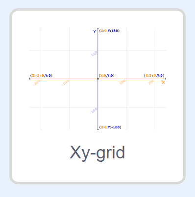

### إحداثيات Scratch

+ في Scratch، يمثل الإحداثيان `x:0, y:0` الموضع المركزي على المنصة.

ويكون الموضع `x:-200, y:-100` ، على سبيل المثال، تجاه أسفل يسار المنصة، بينما يكون الموضع `x:200, y:100` أعلى اليمين تقريبًا.

+ You can see this for yourself by adding the **Xy-grid** backdrop to your project.

