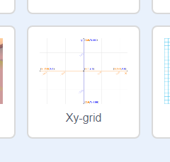

### Scratch স্থানাঙ্ক

+ Scratch এ, ` x: 0, y: 0 ` coordinates গুলি মঞ্চের কেন্দ্রীয় অবস্থান চিহ্নিত করে।.

এর </code>x:-200, y: -100</code> মতো অবস্থান মঞ্চের নীচে বাম দিক,এবং এর  x: 200, y: 100 </0> মতো অবস্থান উপরের ডানদিক নির্দেশ করে।.

<ul>
<li>আপনি আপনার প্রকল্পে <strong>Xy-grid</strong> ব্যাকড্রপ যুক্ত করে এটি নিজের জন্য দেখতে পারেন।.</li>
</ul>

