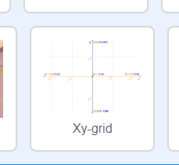

### Scratch-koordinater

+ I Scratch markerer koordinaterne `x: 0, y: 0` den centrale position på scenen.

Positionen `x: -200, y: -100` er nederst til venstre på scenen og positionen `x: 200, y: 100` er øverst til højre.

+ You can see this for yourself by adding the **Xy-grid** backdrop to your project.

