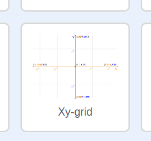

### Συντεταγμένες Scratch

+ Στο Scratch, οι συντεταγμένες `x: 0, y: 0` καθορίζουν την κεντρική θέση στο Σκηνικό.

Μια θέση όπως `x: -200, y: -100` βρίσκεται κάτω αριστερά στο Σκηνικό και μια θέση όπως `x: 200, y: 100` βρίσκεται κοντά στην πάνω δεξιά γωνία.

+ You can see this for yourself by adding the **Xy-grid** backdrop to your project.

