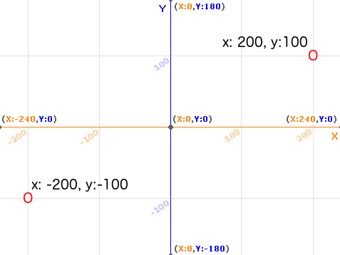

### Coordenadas en Scratch

+ En Scratch, las coordenadas `x:0, y:0` indican la posición central en el escenario.

Una posición como `x:-200, y:-100` está cerca de la parte inferior izquierda del Escenario, y una posición como `x:200, y:100` está cerca de la parte superior a la derecha.

+ Puedes ver esto tú mismo añadiendo el fondo **Xy-grid** a tu proyecto.

