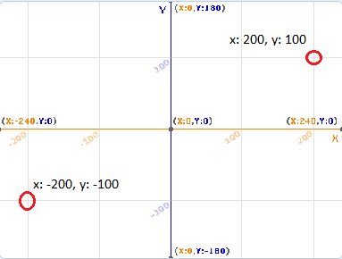
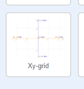

### Scratchi koordinaadid

+ Scratchis märgivad `x: 0, y:0` koordinaadid keskpunkti Laval.

Näiteks punkt koordinaatidega `x:-200, y:-100` on suunaga Lava vasaku alumise nurga poole ja punkt koordinaatidega `x:200, y:100` on parema ülanurga lähedal.

+ Saad seda ise näha, lisades oma projektile **Xy-grid** tausta.

