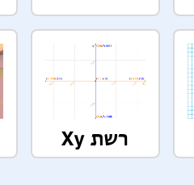

### קואורדינטות Scratch

+ ב- Scratch, הקואורדינטות `x: 0, y: 0` מסמנות את מרכז משטח העבודה.

מיקום כמו `x: -200, y: -100` נמצא בצד שמאל למטה של משטח העבודה, ומיקום כמו `x: 200, y: 100` נמצא בצד שמאל למעלה.

+ You can see this for yourself by adding the **Xy-grid** backdrop to your project.

