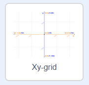

### Scratch koordináták

+ A Scratchben a `x: 0, y: 0` koordináták a játéktér középpontját jelzik.

Egy olyan pozíció, mint az `x: -200, y: -100`, a játéktér bal alsó részén van, és az `x: 200, y: 100` pozíció pedig a jobb felső részén.

+ Ezt magad is megnézheted, ha hozzáadod az **Xy-grid** hátteret a projektedhez.

