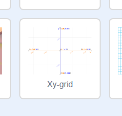

### Le coordinate in Scratch

+ In Scratch, le coordinate `x: 0, y: 0` segnano la posizione centrale sulla scena.

La posizione `x: -200, y: -100` indica l'area della scena in basso a sinistra; la posizione `x: 200, y: 100` indica l'area in alto a destra.

+ Puoi verificarlo aggiungendo lo sfondo **Xy-grid** al tuo progetto.

