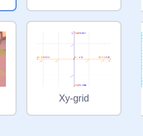

### Współrzędne w Scratchu

+ W Scratchu współrzędne `x: 0, y: 0` oznaczają centralną pozycję na scenie.

Pozycja taka jak `x: -200, y: -100` znajduje się w lewym dolnym rogu sceny, a pozycja taka jak `x: 200, y: 100` znajduje się w prawym górnym rogu.

+ You can see this for yourself by adding the **Xy-grid** backdrop to your project.

