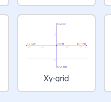

### Coordonatele Scratch

+ În Scratch, coordonatele `x:0, y:0` marchează poziția centrală a scenei.

O poziție ca `x: -200, y: -100` este spre partea din stânga-jos a scenei, iar o poziție ca `x: 200, y: 100` este aproape de partea din dreapta-sus.

+ Poți vedea asta adăugând fundalul **Xy-grid** proiectului tău.

