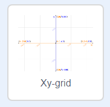

### Scratch koordinatları

+ Scratch'ta, `x:0, y:0`, sahnenin merkez koordinatlarını gösterir.

`x:-200, y:-100` gibi bir konum, sahnenin sol alt köşesine; `x:200, y:100` gibi bir konum ise sağ üst tarafa yakındır.

+ Projenize, **Xy-grid** dekorunu ekleyerek bunu kendiniz de görebilirsiniz.

